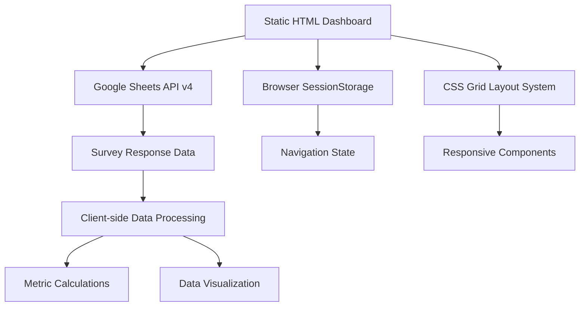

# Design Document

## Overview

The Starlinks Customer Satisfaction Dashboard is a single-page HTML application that provides real-time visualization of customer survey data through Google Sheets API integration. The design follows a clean, professional approach using the Starlinks design system with Euclid Circular B typography and a carefully crafted color palette optimized for data visualization and user experience.

## Architecture

### System Architecture



### Technical Stack
- **Frontend**: Pure HTML5, CSS3, Vanilla JavaScript
- **API Integration**: Google Sheets API v4 with service account authentication
- **State Management**: Browser sessionStorage for navigation persistence
- **Styling**: CSS Custom Properties with design system tokens
- **Layout**: CSS Grid with responsive breakpoints
- **Typography**: Euclid Circular B font family

## Components and Interfaces

### Design System Foundation

#### Color Palette
```css
:root {
  /* Primary Palette - Green Theme */
  --primary-main: #1f6a4a;        /* Primary actions, headers, key metrics */
  --primary-surface: #f2f6f4;     /* Background surfaces, card backgrounds */
  --primary-focus: #e4ede9;       /* Focused states, selected items */
  --primary-border: #d7e4de;      /* Subtle borders, dividers */
  --primary-hover: #2e9e6e;       /* Hover states for primary elements */
  --primary-pressed: #103525;     /* Active/pressed states */
  
  /* Secondary Palette - Orange Theme */
  --secondary-main: #ff9d18;      /* Secondary actions, warnings, highlights */
  --secondary-surface: #fff5e8;   /* Warning backgrounds, secondary surfaces */
  --secondary-focus: #ffebd1;     /* Secondary focused states */
  --secondary-border: #ffd8a3;    /* Secondary borders */
  --secondary-hover: #e58400;     /* Secondary hover states */
  --secondary-pressed: #aa6910;   /* Secondary pressed states */
  
  /* Semantic Colors */
  --success-color: #1f6a4a;       /* Ratings 4-5 */
  --warning-color: #ff9d18;       /* Ratings 3 */
  --error-color: #dc3545;         /* Ratings 1-2 */
}
```

#### Typography Hierarchy
```css
.typography-system {
  font-family: 'Euclid Circular B', -apple-system, BlinkMacSystemFont, sans-serif;
}

.heading-xl { font-size: 2.5rem; font-weight: 600; line-height: 1.2; }
.heading-lg { font-size: 2rem; font-weight: 600; line-height: 1.3; }
.heading-md { font-size: 1.5rem; font-weight: 500; line-height: 1.4; }
.heading-sm { font-size: 1.25rem; font-weight: 500; line-height: 1.4; }
.body-lg { font-size: 1.125rem; font-weight: 400; line-height: 1.6; }
.body-md { font-size: 1rem; font-weight: 400; line-height: 1.6; }
.body-sm { font-size: 0.875rem; font-weight: 400; line-height: 1.5; }
.caption { font-size: 0.75rem; font-weight: 400; line-height: 1.4; }
```

### Core Components

#### 1. Navigation Header
- **Structure**: Fixed header with logo and horizontal tab navigation
- **Behavior**: Smooth tab switching with active state persistence
- **Responsive**: Collapses to vertical stack on mobile devices
- **Accessibility**: Full keyboard navigation with focus indicators

#### 2. Metric Card Component
```css
.metric-card {
  background: var(--primary-surface);
  border: 1px solid var(--primary-border);
  border-radius: 12px;
  padding: 24px;
  box-shadow: 0 2px 8px rgba(31, 106, 74, 0.08);
}

.metric-value {
  font-size: 2.5rem;
  font-weight: 600;
  color: var(--primary-main);
  animation: countUp 1.5s ease-out;
}
```

#### 3. Data Table Component
```css
.data-table {
  background: white;
  border-radius: 12px;
  overflow: hidden;
  box-shadow: 0 2px 8px rgba(31, 106, 74, 0.08);
}

.table-row:nth-child(even) {
  background: var(--primary-surface);
}

.table-row:hover {
  background: var(--primary-focus);
}
```

#### 4. Accordion Card Component
```css
.accordion-card {
  border: 1px solid var(--primary-border);
  border-radius: 8px;
  margin-bottom: 16px;
  transition: all 0.3s ease;
}

.accordion-header {
  padding: 20px;
  cursor: pointer;
  display: flex;
  justify-content: space-between;
  align-items: center;
}

.accordion-content {
  max-height: 0;
  overflow: hidden;
  transition: max-height 0.3s ease;
}
```

#### 5. Progress Bar Component
```css
.progress-bar {
  width: 100%;
  height: 8px;
  background: var(--primary-border);
  border-radius: 4px;
  overflow: hidden;
}

.progress-fill {
  height: 100%;
  background: var(--primary-main);
  transition: width 1s ease-out;
}
```

### Layout System

#### CSS Grid Implementation
```css
.dashboard-container {
  display: grid;
  grid-template-rows: auto 1fr;
  min-height: 100vh;
}

.content-grid {
  display: grid;
  grid-template-columns: repeat(auto-fit, minmax(300px, 1fr));
  gap: 24px;
  padding: 24px;
}

/* F-Pattern Optimization */
.metrics-grid {
  display: grid;
  grid-template-columns: 2fr 1fr 1fr;
  gap: 24px;
}

@media (max-width: 768px) {
  .metrics-grid {
    grid-template-columns: 1fr;
  }
}
```

## Data Models

### Survey Response Model
```javascript
const SurveyResponse = {
  companyName: String,
  serviceType: String, // "Last Mile Only" | "Fulfillment Only" | "Last Mile & Fulfillment"
  overallSatisfaction: Number, // 1-5 scale
  npsScore: Number, // 1-10 scale
  lastMileSatisfaction: Number, // 1-5 scale
  reverseDeliverySatisfaction: Number, // 1-5 scale
  fulfillmentSatisfaction: Number, // 1-5 scale
  accountManager: String,
  communicationClarity: Number, // 1-5 scale
  responsiveness: Number, // 1-5 scale
  problemResolution: Number, // 1-5 scale
  customizationAbility: Number, // 1-5 scale
  systemsSatisfaction: Number, // 1-5 scale
  itSupportSatisfaction: Number, // 1-5 scale
  suggestions: String,
  submittedAt: Date
};
```

### Calculated Metrics Model
```javascript
const DashboardMetrics = {
  totalSurveys: Number,
  completedSurveys: Number,
  pendingSurveys: Number,
  completionPercentage: Number,
  satisfiedCustomersPercentage: Number,
  productTypeBreakdown: {
    lastMileOnly: { completed: Number, satisfied: Number },
    fulfillmentOnly: { completed: Number, satisfied: Number },
    combined: { completed: Number, satisfied: Number }
  },
  accountManagerMetrics: {
    [managerName]: {
      completed: Number,
      pending: Number,
      completionRate: Number,
      satisfactionRate: Number
    }
  }
};
```

## Error Handling

### API Error Management
```javascript
const ErrorHandler = {
  // Network connectivity issues
  handleNetworkError: () => {
    displayMessage("Connection issue. Retrying in 60 seconds...", "warning");
    scheduleRetry(60000);
  },
  
  // Authentication failures
  handleAuthError: () => {
    displayMessage("Authentication failed. Please check API credentials.", "error");
  },
  
  // Data parsing errors
  handleDataError: () => {
    displayMessage("Data format error. Please verify sheet structure.", "error");
  },
  
  // Rate limiting
  handleRateLimit: () => {
    displayMessage("Rate limit reached. Slowing down requests...", "warning");
    increaseRefreshInterval();
  }
};
```

### Graceful Degradation
- **No Data State**: Display empty state with helpful messaging
- **Partial Data**: Show available metrics with indicators for missing data
- **Offline Mode**: Cache last successful response for offline viewing
- **Loading States**: Skeleton animations during data fetching

## Testing Strategy

### Unit Testing Approach
1. **Data Processing Functions**
   - Metric calculation accuracy
   - Data transformation logic
   - Edge case handling (empty data, invalid values)

2. **UI Component Testing**
   - Tab navigation functionality
   - Accordion expand/collapse behavior
   - Responsive layout breakpoints

3. **API Integration Testing**
   - Authentication flow validation
   - Data fetching and caching logic
   - Error handling scenarios

### Manual Testing Checklist
- [ ] Cross-browser compatibility (Chrome, Firefox, Safari, Edge)
- [ ] Mobile responsiveness across device sizes
- [ ] Keyboard navigation accessibility
- [ ] Screen reader compatibility
- [ ] Performance with large datasets (100+ survey responses)
- [ ] Network failure recovery
- [ ] Real-time data refresh accuracy

### Performance Benchmarks
- **Initial Load Time**: < 3 seconds on 3G connection
- **Tab Switch Time**: < 200ms
- **Data Refresh Time**: < 1 second for typical dataset
- **Memory Usage**: < 50MB for 500 survey responses
- **Accessibility Score**: 95+ on Lighthouse audit

## Implementation Phases

### Phase 1: Core Structure (Foundation)
- HTML structure with semantic markup
- CSS design system implementation
- Basic navigation functionality
- Responsive grid layout

### Phase 2: Google Sheets Integration
- API authentication setup
- Data fetching and caching logic
- Error handling implementation
- Loading states and animations

### Phase 3: Dashboard Pages
- CSAT Summary with animated metrics
- Customer Status tables with sorting
- Completed Surveys accordion interface
- Account Manager Performance cards

### Phase 4: Polish and Optimization
- Accessibility enhancements
- Performance optimizations
- Cross-browser testing
- Final UI refinements

This design provides a solid foundation for building a professional, maintainable, and user-friendly customer satisfaction dashboard that meets all the specified requirements while following modern web development best practices.